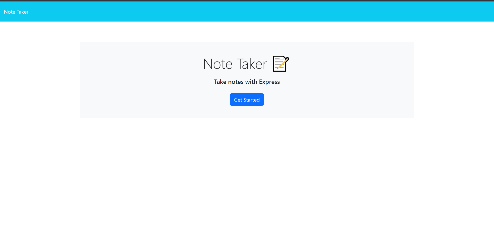
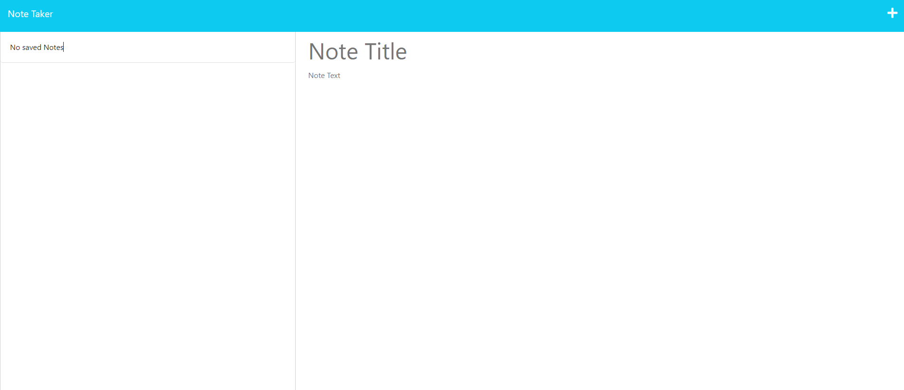
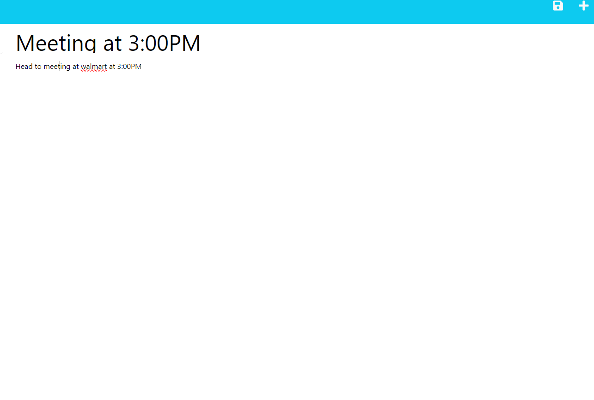
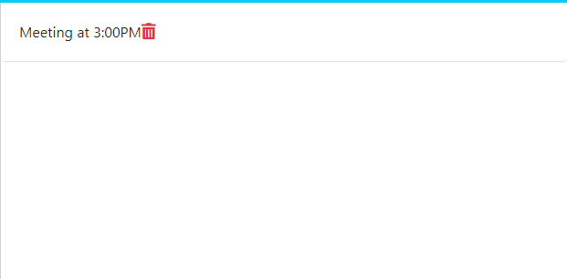
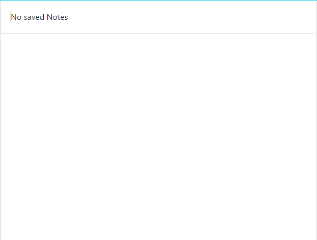

  # Express Note Taker
  
  
  
    

  ## Table-of-Contents

  * [Description](#description)
  * [Installation](#installation)
  * [Usage](#usage)
  * [Contributing](#contributing)
  * [Tests](#tests)
  * [Screenshots](#screenshots)
  * [Deployed Application](#application)
  * [Questions](#questions)
  
  ## [Description](#table-of-contents)

  This application allows you to write notes down and save. It also allows you to view older notes and delete them.

  ## [Installation](#table-of-contents)

  In order to install this application you must clone the repo or download the zip file.
  
  ## [License](#table-of-contents)

  The application is covered under the following license:
  
  [mit](https://choosealicense.com/licenses/mit)
      
  ## [Tests](#table-of-contents)

  1. Download or clone the repo from github 
  2. Open the terminal and install the dependencies required which is npm install express 
  3. After that keep the terminal open and enter node server.js

  ## [Screenshots](#table-of-contents)

  Main Page to enter notes section

  

  Notes Page

  

  Save icon with notes written down

  

  Saved note on the left side of the page with delete button next to it

  

  Note after you press delete button

  

  ## [Deployed Application](#table-of-contents)

  https://express-note-taker-jg-b6fe107a2598.herokuapp.com/ 

  ## [Questions](#table-of-contents)

  Please contact me using the following links:

  [GitHub](https://github.com/joaquingodina0)

  [Email: joaquingodina@icloud.com](mailto:joaquingodina@icloud.com)
